# TPs de Características de Lenguajes de Programación
## Di Salvo, Tobías

## TP 1
Empezaremos con un mapa conceptual sobre los traductores existentes en la programación. El mapa fue realizado en la herramienta Mermaid, utilizada para dar formato a los bloques de conceptos y sus relaciones. Esta es mi propuesta:


Aquí tenemos el código utilizado para el mapa conceptual:

```markdown
---
config:
  layout: elk
---
flowchart TD
    A["Traductores de Lenguaje"] -- Función --> B["Convierte lenguaje fuente a objeto"]
    B -- Ejemplo --> B2["De C a Pascal"]
    A -- Clasificados en --> C["Tipos de Traductores"]
    C -- Puede ser --> C1["Ensamblador"] & C2["Interprete"] & C3["Compilador"]
    C1 -- Lenguaje fuente --> C1a["Ensamblador"]
    C1 -- Genera --> C1b["Codigo maquina"]
    C1 -- Caracteristica --> C1c["Correspondencia 1:1 instrucciones"]
    C1 -- Ejemplo --> C1d["LD HL,#0100 -> 65h.00h.01h"]
    C1 -- Ofrece --> C1e["Ventajas"]
    C1e -- Son --> C1e1["Veloces"] & C1e2["Exactos"]
    C1 -- Presenta --> C1f["Desventajas"]
    C1f -- Son --> C1f1["Dificil de escribir/leer"]
    C1f -- Es --> C1f2["Dependiente de la maquina"]
    C2 -- Permite --> C2b["Agregar sentencias en ejecucion"]
    C2 -- Ejemplos --> C2c["Basic, Python, Ruby, JS, SmallTalk"]
    C2 -- Ejecuta --> C2a["Sentencia por sentencia"]
    C3 -- Fuente --> C3a["Alto nivel"]
    C3 -- Genera --> C3b["Bajo nivel"] & X["Archivos binarios ejecutables"]
    C3 -- Analiza --> C3c["Todo el programa -> codigo objeto"]
    C3 -- Ventaja --> C3d["Ejecucion rapida"]
    C3 -- Ejemplos --> C3e["C, C++, Pascal, Fortran, COBOL, Go"]
    C3 -- Historia --> C3f["Hitos"]
    C3f -- 1951 --> C3f1["Grace Hopper -> A-0 en UNIVAC"]
    C3f -- 1954 --> C3f2["John Backus -> FORTRAN en IBM 704"]
    A -- Requiere --> D["Herramientas para Compiladores"]
    D -- Incluyen --> D1["Editores"] & D2["Preprocesadores"] & D3["Enlazadores"] & D4["Cargadores"] & D5["Depuradores"] & D6["Desensambladores"] & D7["Decompiladores"] & D8["Transpiladores"]
    D1 -- Sirven para --> D1a["Leer/escribir programas"]
    D1 -- Integrados en --> D1b["IDEs"]
    D1 -- Formato --> D1c["ASCII"]
    D2 -- Tarea --> D2a["Sustituir macros"] & D2b["Incluir archivos/librerias"] & D2c["Eliminar comentarios"]
    D3 -- Unen --> D3a["Modulos -> ejecutable"]
    D3 -- Enlazan --> D3b["Librerias .lib / .dll"]
    D4 -- Asignan --> D4a["Direcciones y memoria"]
    D4 -- Transforman --> D4b["Codigo reubicable -> posiciones reales"]
    D4 -- Forman parte de --> D4c["Sistema Operativo"]
    D5 -- Permiten --> D5a["Detectar/solucionar errores"]
    D5 -- Ejecutan --> D5b["Paso a paso"]
    D5 -- Muestran --> D5c["Valores de variables"]
    D6 -- Traducen --> D6a["Maquina -> Ensamblador"]
    D6 -- Usados en --> D6b["Ingenieria inversa"]
    D7 -- Traducen --> D7a["Maquina -> Lenguaje alto nivel"]
    D7 -- Ejemplo --> D7b["Java"]
    D8 -- Convierten --> D8a["Lenguaje -> otro lenguaje"]
    D8 -- Ejemplo --> D8b["Babel JS moderno -> JS antiguo"]
    X -- Leidos por --> D4
    C3 -- Necesita --> D2
    C3 -- Usa --> D3
    C3 -- Reversible con --> D7
    D3 -- Entrega a --> D4
    D4 -- Permite --> RUN["Ejecucion del programa"]
    RUN -- Puede ser analizada con --> D5
    C1 -- Es reversible con --> D6
    D6 -- Similar a --> D7
    D7 -- Similar a --> D8
```

```mermaid
---
config:
  layout: elk
---
flowchart TD
    A["Traductores de Lenguaje"] -- Función --> B["Convierte lenguaje fuente a objeto"]
    B -- Ejemplo --> B2["De C a Pascal"]
    A -- Clasificados en --> C["Tipos de Traductores"]
    C -- Puede ser --> C1["Ensamblador"] & C2["Interprete"] & C3["Compilador"]
    C1 -- Lenguaje fuente --> C1a["Ensamblador"]
    C1 -- Genera --> C1b["Codigo maquina"]
    C1 -- Caracteristica --> C1c["Correspondencia 1:1 instrucciones"]
    C1 -- Ejemplo --> C1d["LD HL,#0100 -> 65h.00h.01h"]
    C1 -- Ofrece --> C1e["Ventajas"]
    C1e -- Son --> C1e1["Veloces"] & C1e2["Exactos"]
    C1 -- Presenta --> C1f["Desventajas"]
    C1f -- Son --> C1f1["Dificil de escribir/leer"]
    C1f -- Es --> C1f2["Dependiente de la maquina"]
    C2 -- Permite --> C2b["Agregar sentencias en ejecucion"]
    C2 -- Ejemplos --> C2c["Basic, Python, Ruby, JS, SmallTalk"]
    C2 -- Ejecuta --> C2a["Sentencia por sentencia"]
    C3 -- Fuente --> C3a["Alto nivel"]
    C3 -- Genera --> C3b["Bajo nivel"] & X["Archivos binarios ejecutables"]
    C3 -- Analiza --> C3c["Todo el programa -> codigo objeto"]
    C3 -- Ventaja --> C3d["Ejecucion rapida"]
    C3 -- Ejemplos --> C3e["C, C++, Pascal, Fortran, COBOL, Go"]
    C3 -- Historia --> C3f["Hitos"]
    C3f -- 1951 --> C3f1["Grace Hopper -> A-0 en UNIVAC"]
    C3f -- 1954 --> C3f2["John Backus -> FORTRAN en IBM 704"]
    A -- Requiere --> D["Herramientas para Compiladores"]
    D -- Incluyen --> D1["Editores"] & D2["Preprocesadores"] & D3["Enlazadores"] & D4["Cargadores"] & D5["Depuradores"] & D6["Desensambladores"] & D7["Decompiladores"] & D8["Transpiladores"]
    D1 -- Sirven para --> D1a["Leer/escribir programas"]
    D1 -- Integrados en --> D1b["IDEs"]
    D1 -- Formato --> D1c["ASCII"]
    D2 -- Tarea --> D2a["Sustituir macros"] & D2b["Incluir archivos/librerias"] & D2c["Eliminar comentarios"]
    D3 -- Unen --> D3a["Modulos -> ejecutable"]
    D3 -- Enlazan --> D3b["Librerias .lib / .dll"]
    D4 -- Asignan --> D4a["Direcciones y memoria"]
    D4 -- Transforman --> D4b["Codigo reubicable -> posiciones reales"]
    D4 -- Forman parte de --> D4c["Sistema Operativo"]
    D5 -- Permiten --> D5a["Detectar/solucionar errores"]
    D5 -- Ejecutan --> D5b["Paso a paso"]
    D5 -- Muestran --> D5c["Valores de variables"]
    D6 -- Traducen --> D6a["Maquina -> Ensamblador"]
    D6 -- Usados en --> D6b["Ingenieria inversa"]
    D7 -- Traducen --> D7a["Maquina -> Lenguaje alto nivel"]
    D7 -- Ejemplo --> D7b["Java"]
    D8 -- Convierten --> D8a["Lenguaje -> otro lenguaje"]
    D8 -- Ejemplo --> D8b["Babel JS moderno -> JS antiguo"]
    X -- Leidos por --> D4
    C3 -- Necesita --> D2
    C3 -- Usa --> D3
    C3 -- Reversible con --> D7
    D3 -- Entrega a --> D4
    D4 -- Permite --> RUN["Ejecucion del programa"]
    RUN -- Puede ser analizada con --> D5
    C1 -- Es reversible con --> D6
    D6 -- Similar a --> D7
    D7 -- Similar a --> D8
```

