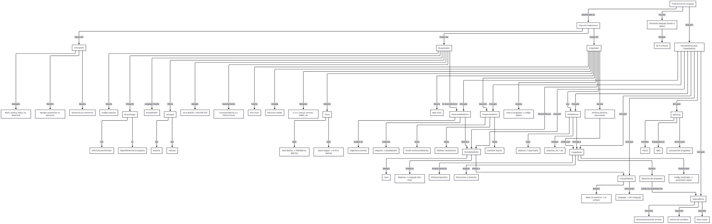

```mermaid
---
config:
  layout: elk
---
flowchart TD
    A["Traductores de Lenguaje"] -- Función --> B["Convierte lenguaje fuente a objeto"]
    B -- Ejemplo --> B2["De C a Pascal"]
    A -- Clasificados en --> C["Tipos de Traductores"]
    C -- Puede ser --> C1["Ensamblador"] & C2["Interprete"] & C3["Compilador"]
    C1 -- Lenguaje fuente --> C1a["Ensamblador"]
    C1 -- Genera --> C1b["Codigo maquina"]
    C1 -- Caracteristica --> C1c["Correspondencia 1:1 instrucciones"]
    C1 -- Ejemplo --> C1d["LD HL,#0100 -> 65h.00h.01h"]
    C1 -- Ofrece --> C1e["Ventajas"]
    C1e -- Son --> C1e1["Veloces"] & C1e2["Exactos"]
    C1 -- Presenta --> C1f["Desventajas"]
    C1f -- Son --> C1f1["Dificil de escribir/leer"]
    C1f -- Es --> C1f2["Dependiente de la maquina"]
    C2 -- Permite --> C2b["Agregar sentencias en ejecucion"]
    C2 -- Ejemplos --> C2c["Basic, Python, Ruby, JS, SmallTalk"]
    C2 -- Ejecuta --> C2a["Sentencia por sentencia"]
    C3 -- Fuente --> C3a["Alto nivel"]
    C3 -- Genera --> C3b["Bajo nivel"] & X["Archivos binarios ejecutables"]
    C3 -- Analiza --> C3c["Todo el programa -> codigo objeto"]
    C3 -- Ventaja --> C3d["Ejecucion rapida"]
    C3 -- Ejemplos --> C3e["C, C++, Pascal, Fortran, COBOL, Go"]
    C3 -- Historia --> C3f["Hitos"]
    C3f -- 1951 --> C3f1["Grace Hopper -> A-0 en UNIVAC"]
    C3f -- 1954 --> C3f2["John Backus -> FORTRAN en IBM 704"]
    A -- Requiere --> D["Herramientas para Compiladores"]
    D -- Incluyen --> D1["Editores"] & D2["Preprocesadores"] & D3["Enlazadores"] & D4["Cargadores"] & D5["Depuradores"] & D6["Desensambladores"] & D7["Decompiladores"] & D8["Transpiladores"]
    D1 -- Sirven para --> D1a["Leer/escribir programas"]
    D1 -- Integrados en --> D1b["IDEs"]
    D1 -- Formato --> D1c["ASCII"]
    D2 -- Tarea --> D2a["Sustituir macros"] & D2b["Incluir archivos/librerias"] & D2c["Eliminar comentarios"]
    D3 -- Unen --> D3a["Modulos -> ejecutable"]
    D3 -- Enlazan --> D3b["Librerias .lib / .dll"]
    D4 -- Asignan --> D4a["Direcciones y memoria"]
    D4 -- Transforman --> D4b["Codigo reubicable -> posiciones reales"]
    D4 -- Forman parte de --> D4c["Sistema Operativo"]
    D5 -- Permiten --> D5a["Detectar/solucionar errores"]
    D5 -- Ejecutan --> D5b["Paso a paso"]
    D5 -- Muestran --> D5c["Valores de variables"]
    D6 -- Traducen --> D6a["Maquina -> Ensamblador"]
    D6 -- Usados en --> D6b["Ingenieria inversa"]
    D7 -- Traducen --> D7a["Maquina -> Lenguaje alto nivel"]
    D7 -- Ejemplo --> D7b["Java"]
    D8 -- Convierten --> D8a["Lenguaje -> otro lenguaje"]
    D8 -- Ejemplo --> D8b["Babel JS moderno -> JS antiguo"]
    X -- Leidos por --> D4
    C3 -- Necesita --> D2
    C3 -- Usa --> D3
    C3 -- Reversible con --> D7
    D3 -- Entrega a --> D4
    D4 -- Permite --> RUN["Ejecucion del programa"]
    RUN -- Puede ser analizada con --> D5
    C1 -- Es reversible con --> D6
    D6 -- Similar a --> D7
    D7 -- Similar a --> D8
```

# TPs de Características de Lenguajes de Programación
## Di Salvo, Tobías

## TP 1
Empezaremos con un mapa conceptual sobre los traductores existentes en la programación. El mapa fue realizado en la herramienta Mermaid, utilizada para dar formato a los bloques de conceptos y sus relaciones. Esta es mi propuesta:



Aquí tenemos el código utilizado para el mapa conceptual:

```markdown
---
config:
  layout: elk
---
flowchart TD
    A["Traductores de Lenguaje"] -- Función --> B["Convierte lenguaje fuente a objeto"]
    B -- Ejemplo --> B2["De C a Pascal"]
    A -- Clasificados en --> C["Tipos de Traductores"]
    C -- Puede ser --> C1["Ensamblador"] & C2["Interprete"] & C3["Compilador"]
    C1 -- Lenguaje fuente --> C1a["Ensamblador"]
    C1 -- Genera --> C1b["Codigo maquina"]
    C1 -- Caracteristica --> C1c["Correspondencia 1:1 instrucciones"]
    C1 -- Ejemplo --> C1d["LD HL,#0100 -> 65h.00h.01h"]
    C1 -- Ofrece --> C1e["Ventajas"]
    C1e -- Son --> C1e1["Veloces"] & C1e2["Exactos"]
    C1 -- Presenta --> C1f["Desventajas"]
    C1f -- Son --> C1f1["Dificil de escribir/leer"]
    C1f -- Es --> C1f2["Dependiente de la maquina"]
    C2 -- Permite --> C2b["Agregar sentencias en ejecucion"]
    C2 -- Ejemplos --> C2c["Basic, Python, Ruby, JS, SmallTalk"]
    C2 -- Ejecuta --> C2a["Sentencia por sentencia"]
    C3 -- Fuente --> C3a["Alto nivel"]
    C3 -- Genera --> C3b["Bajo nivel"] & X["Archivos binarios ejecutables"]
    C3 -- Analiza --> C3c["Todo el programa -> codigo objeto"]
    C3 -- Ventaja --> C3d["Ejecucion rapida"]
    C3 -- Ejemplos --> C3e["C, C++, Pascal, Fortran, COBOL, Go"]
    C3 -- Historia --> C3f["Hitos"]
    C3f -- 1951 --> C3f1["Grace Hopper -> A-0 en UNIVAC"]
    C3f -- 1954 --> C3f2["John Backus -> FORTRAN en IBM 704"]
    A -- Requiere --> D["Herramientas para Compiladores"]
    D -- Incluyen --> D1["Editores"] & D2["Preprocesadores"] & D3["Enlazadores"] & D4["Cargadores"] & D5["Depuradores"] & D6["Desensambladores"] & D7["Decompiladores"] & D8["Transpiladores"]
    D1 -- Sirven para --> D1a["Leer/escribir programas"]
    D1 -- Integrados en --> D1b["IDEs"]
    D1 -- Formato --> D1c["ASCII"]
    D2 -- Tarea --> D2a["Sustituir macros"] & D2b["Incluir archivos/librerias"] & D2c["Eliminar comentarios"]
    D3 -- Unen --> D3a["Modulos -> ejecutable"]
    D3 -- Enlazan --> D3b["Librerias .lib / .dll"]
    D4 -- Asignan --> D4a["Direcciones y memoria"]
    D4 -- Transforman --> D4b["Codigo reubicable -> posiciones reales"]
    D4 -- Forman parte de --> D4c["Sistema Operativo"]
    D5 -- Permiten --> D5a["Detectar/solucionar errores"]
    D5 -- Ejecutan --> D5b["Paso a paso"]
    D5 -- Muestran --> D5c["Valores de variables"]
    D6 -- Traducen --> D6a["Maquina -> Ensamblador"]
    D6 -- Usados en --> D6b["Ingenieria inversa"]
    D7 -- Traducen --> D7a["Maquina -> Lenguaje alto nivel"]
    D7 -- Ejemplo --> D7b["Java"]
    D8 -- Convierten --> D8a["Lenguaje -> otro lenguaje"]
    D8 -- Ejemplo --> D8b["Babel JS moderno -> JS antiguo"]
    X -- Leidos por --> D4
    C3 -- Necesita --> D2
    C3 -- Usa --> D3
    C3 -- Reversible con --> D7
    D3 -- Entrega a --> D4
    D4 -- Permite --> RUN["Ejecucion del programa"]
    RUN -- Puede ser analizada con --> D5
    C1 -- Es reversible con --> D6
    D6 -- Similar a --> D7
    D7 -- Similar a --> D8
```



## Lenguaje de programación

**MagicLang**
### Objetivo
MagicLang es un lenguaje de programación esotérico de estilo imperativo cuyo objetivo principal es ofrecer una experiencia lúdica y temática inspirada en el vocabulario vinculado a la magia. Sus construcciones sintácticas, como hechizo, invocar, conjurar, ritual, encantar o forjar, remiten al imaginario de los rituales y encantamientos, haciendo que el código se interprete como un grimorio.

### Alcance
Se trata de un lenguaje de estilo imperativo secuencial, el cual permite la definición de variables y el uso de estructuras de control, pero que se distingue por la incorporación de un vocabulario temático vinculado a la magia. De este modo, palabras clave como hechizo, invocar, ritual o conjurar constituyen construcciones sintácticas que acercar la programación a una experiencia narrativa, lúdica y creativa. MagicLang no está concebido para el desarrollo de software profesional ni para la optimización de rendimiento, ya que su propósito es principalmente conceptual y expresivo. Sus usuarios esperados son estudiantes, entusiastas de los lenguajes esotéricos y personas interesadas en explorar la programación desde una perspectiva distinta, más cercana al juego y la imaginación que a la producción industrial.

### Aspectos Léxicos

| Categoría               | ER                                   | Describe… |
|--------------------------|--------------------------------------|-----------|
| Palabras clave mágicas   | `(hechizo\|invocar\|conjurar\|ritual\|fallido\|encantar\|forjar)` | Reservadas del lenguaje, representan construcciones sintácticas mágicas. |
| Identificadores          | `(a\|...\|z)(a\|...\|z\|A\|...\|Z\|0\|...\|9\|_\|-\|#\|$\|?)*`             | Nombres de variables, funciones o entidades mágicas. |
| Literales numéricos      | `0\|...\|9`                        | Valores enteros o decimales. |
| Literales booleanos      | `(Verdadero\|Falso)`              | Valores lógicos verdaderos o falsos. |
| Operadores aritméticos   | `(+\|-\|*\|/\|%)`                           | Suma, resta, multiplicación, división y módulo. |
| Operadores relacionales  | `(==\|!=\|<=\|>=\|<\|>)`                  | Comparaciones entre valores. |
| Operadores lógicos       | `(&& \| \|\| \| !)`                        | Conjunción, disyunción y negación. |
| Símbolos de agrupación   | `(()\|{}\|[]]`                     | Paréntesis, llaves y corchetes. |
| Delimitador de sentencia | `;`                                  | Marca el fin de una instrucción. |

### Aspectos Sintácticos
```HTML
<programa> ::= { <lista_sentencias> }
<lista_sentencias> ::= <sentencia> | <sentencia> <lista_sentencias>
<sentencia> ::= λ | <asignacion>; | <funcion> | <invocacion>; | <repeticion> | <condicional> | <imprimir>;

<asignacion> ::= forjar <identificador> = <valor>

<identificador> ::= <minuscula> <caracteres>
<caracteres> ::= λ | <caracter><caracteres>
<caracter> ::= <minuscula> | <mayuscula> | <numero> | <simbolo>

<funcion> ::= hechizo <identificador>(<vacio_o_parametros>) <bloque>

<vacio_o_parametros> ::= λ | <parametros>
<parametros> ::= <identificador> | <identificador>, <parametros>
<bloque> ::= [<lista_sentencias>]

<invocacion> ::= invocar <identificador>(<vacio_o_argumento>) | invocar <bloque>
<vacio_o_argumento> ::= λ | <argumento>
<argumento> ::= <valor> | <valor>, <argumento>

<repeticion> ::= conjurar (<valor_numerico>) veces <bloque>

<condicional> ::= ritual(<valor_booleano>) <bloque> | ritual(<valor_booleano>) <bloque> fallido <bloque>

<imprimir> ::= encantar(<valor>)

<valor> ::= <valor_numerico> | <valor_booleano>

<valor_numerico> ::= <numero> | <operacion_numerica> | <identificador>
<operacion_numerica> ::= <valor_numerico> <operador_numerico> <valor_numerico> | (<valor_numerico>)

<valor_booleano> ::= <booleano> | <operacion_booleana> | <identificador>
<operacion_booleana> ::= no <valor_booleano> | <valor_booleano> <operador_booleano> <valor_booleano> | <valor_numerico> <comparador_numerico> <valor_numerico> | (<valor_booleano>)

<operador_numerico> ::= + | - | * | / | %
<comparador_numerico> ::= <comparacion> | < | > | <= | >=
<operador_booleano> ::= <comparacion> | y | o
<comparacion> ::= == | !=
<booleano> ::= Verdadero | Falso
<numero> ::= <digito> | <digito><numero>
<digito> ::= 0 | 1 | 2 | 3 | 4 | 5 | 6 | 7 | 8 | 9
<minuscula> ::= a | b | c | d | e | f | g | h | i | j | k | l | m | n | ñ | o | p | q | r | s | t | u | v | w | x | y | z
<mayuscula> ::= A | B | C | D | E | F | G | H | I | J | K | L | M | N | Ñ | O | P | Q | R | S | T | U | V | W | X | Y | Z
<simbolo> ::= _ | - | # | $ | ?
```

### Aspectos Semánticos
**Binding**

| Elemento | Atributo | Momento de ligadura / Binding |
|----------|----------|-------------------------------|
| Variable | Tipo | Dinámico: determinado al asignar un valor en tiempo de ejecución |
| Variable | Almacenamiento | Dinámico: la memoria se asigna al ejecutar `forjar` |
| Variable | Alcance | Estático: definido por el bloque donde se declara |
| Variable | Nombre | Estático: definido en el momento de escritura del programa |
| Función / Método | Acción asociada | Estático: asociada al declarar el `hechizo` |
| Parámetro | Valor | Dinámico: ligado al pasar el argumento en la invocación |
| Bloque | Variables locales | Estático: se determina al definir el bloque |
| Sentencia | Operación | Dinámico: se evalúa en tiempo de ejecución |

---
**Palabras reservadas**

| Palabra reservada | Elemento Relacionado | Atributos | Descripción |
|------------------|--------------------|-----------|-------------|
| forjar | Variable | Nombre, Valor, Tipo, Alcance | Asigna un valor a una posición de memoria y crea/modifica variables en el bloque actual. |
| hechizo | Función / Método | Nombre, Parámetros, Tipo de retorno implícito, Cuerpo ejecutable | Define un bloque de código reutilizable con parámetros que realiza una acción específica. |
| invocar | Sentencia / Función | Acción asociada, Parámetros | Ejecuta un bloque anónimo o un `hechizo` previamente declarado, pasando valores a sus parámetros. |
| conjurar | Sentencia / Bloque | Condición, Repeticiones | Ejecuta un bloque de instrucciones un número determinado de veces (similar a un bucle for). |
| ritual | Sentencia / Bloque condicional | Condición, Bloque verdadero, Bloque fallido | Ejecuta un bloque si la condición es verdadera, o el bloque alternativo si es falsa (equivalente a if-else). |
| fallido | Sentencia / Bloque condicional | Bloque alternativo | Bloque que se ejecuta cuando la condición de un `ritual` es falsa. |
| encantar | Sentencia | Valor | Muestra en la salida el valor de una variable o expresión. |

---
**Tipos de Datos y Sistema de Tipos**

- Tipos del lenguaje: enteros, booleanos y cadenas de texto.
- Tipado: dinámico, ya que el tipo de una variable se determina en la asignación y puede variar según el valor.
- Sistema de tipos: débil, ya que no establece operaciones entre tipos.

## Scanner

Para el scanner utilizaré la dependencia **ply.lex**, por lo que utilizaré el lenguaje **Python**.

### Tabla con expresiones regulares adaptadas para los analizadores léxicos
| Categoría               | Expresión |
|--------------------------|-----------|
| Palabras clave mágicas   | `\b(hechizo\|invocar\|conjurar\|ritual\|fallido\|encantar\|forjar)\b` |
| Identificadores          | `[a-z][a-zA-Z0-9_\-#$?]*` |
| Literales numéricos      | `\d+` |
| Literales booleanos      | `(Verdadero\|Falso)` |
| Operadores aritméticos   | `(\+\|\-\|\*\|/\|%)` |
| Operadores relacionales  | `(==\|!=\|<=\|>=\|<\|>)` |
| Operadores lógicos       | `(&&\| \|\| \| !)` |
| Símbolos de agrupación   | `[()\[\]{}]` |
| Delimitador de sentencia | `;` |