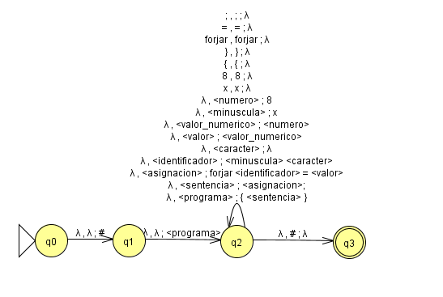

# TPs de Características de Lenguajes de Programación
## Di Salvo, Tobías

## TP 1
Empezaremos con un mapa conceptual sobre los traductores existentes en la programación. El mapa fue realizado en la herramienta Mermaid, utilizada para dar formato a los bloques de conceptos y sus relaciones. Esta es mi propuesta:


Aquí tenemos el código utilizado para el mapa conceptual:

```markdown
---
config:
  layout: elk
---
flowchart TD
    A["Traductores de Lenguaje"] -- Función --> B["Convierte lenguaje fuente a objeto"]
    B -- Ejemplo --> B2["De C a Pascal"]
    A -- Clasificados en --> C["Tipos de Traductores"]
    C -- Puede ser --> C1["Ensamblador"] & C2["Interprete"] & C3["Compilador"]
    C1 -- Lenguaje fuente --> C1a["Ensamblador"]
    C1 -- Genera --> C1b["Codigo maquina"]
    C1 -- Caracteristica --> C1c["Correspondencia 1:1 instrucciones"]
    C1 -- Ejemplo --> C1d["LD HL,#0100 -> 65h.00h.01h"]
    C1 -- Ofrece --> C1e["Ventajas"]
    C1e -- Son --> C1e1["Veloces"] & C1e2["Exactos"]
    C1 -- Presenta --> C1f["Desventajas"]
    C1f -- Son --> C1f1["Dificil de escribir/leer"]
    C1f -- Es --> C1f2["Dependiente de la maquina"]
    C2 -- Permite --> C2b["Agregar sentencias en ejecucion"]
    C2 -- Ejemplos --> C2c["Basic, Python, Ruby, JS, SmallTalk"]
    C2 -- Ejecuta --> C2a["Sentencia por sentencia"]
    C3 -- Fuente --> C3a["Alto nivel"]
    C3 -- Genera --> C3b["Bajo nivel"] & X["Archivos binarios ejecutables"]
    C3 -- Analiza --> C3c["Todo el programa -> codigo objeto"]
    C3 -- Ventaja --> C3d["Ejecucion rapida"]
    C3 -- Ejemplos --> C3e["C, C++, Pascal, Fortran, COBOL, Go"]
    C3 -- Historia --> C3f["Hitos"]
    C3f -- 1951 --> C3f1["Grace Hopper -> A-0 en UNIVAC"]
    C3f -- 1954 --> C3f2["John Backus -> FORTRAN en IBM 704"]
    A -- Requiere --> D["Herramientas para Compiladores"]
    D -- Incluyen --> D1["Editores"] & D2["Preprocesadores"] & D3["Enlazadores"] & D4["Cargadores"] & D5["Depuradores"] & D6["Desensambladores"] & D7["Decompiladores"] & D8["Transpiladores"]
    D1 -- Sirven para --> D1a["Leer/escribir programas"]
    D1 -- Integrados en --> D1b["IDEs"]
    D1 -- Formato --> D1c["ASCII"]
    D2 -- Tarea --> D2a["Sustituir macros"] & D2b["Incluir archivos/librerias"] & D2c["Eliminar comentarios"]
    D3 -- Unen --> D3a["Modulos -> ejecutable"]
    D3 -- Enlazan --> D3b["Librerias .lib / .dll"]
    D4 -- Asignan --> D4a["Direcciones y memoria"]
    D4 -- Transforman --> D4b["Codigo reubicable -> posiciones reales"]
    D4 -- Forman parte de --> D4c["Sistema Operativo"]
    D5 -- Permiten --> D5a["Detectar/solucionar errores"]
    D5 -- Ejecutan --> D5b["Paso a paso"]
    D5 -- Muestran --> D5c["Valores de variables"]
    D6 -- Traducen --> D6a["Maquina -> Ensamblador"]
    D6 -- Usados en --> D6b["Ingenieria inversa"]
    D7 -- Traducen --> D7a["Maquina -> Lenguaje alto nivel"]
    D7 -- Ejemplo --> D7b["Java"]
    D8 -- Convierten --> D8a["Lenguaje -> otro lenguaje"]
    D8 -- Ejemplo --> D8b["Babel JS moderno -> JS antiguo"]
    X -- Leidos por --> D4
    C3 -- Necesita --> D2
    C3 -- Usa --> D3
    C3 -- Reversible con --> D7
    D3 -- Entrega a --> D4
    D4 -- Permite --> RUN["Ejecucion del programa"]
    RUN -- Puede ser analizada con --> D5
    C1 -- Es reversible con --> D6
    D6 -- Similar a --> D7
    D7 -- Similar a --> D8
```


## Lenguaje de programación

**MagicLang**
### Objetivo
MagicLang es un lenguaje de programación esotérico de estilo imperativo cuyo objetivo principal es ofrecer una experiencia lúdica y temática inspirada en el vocabulario vinculado a la magia. Sus construcciones sintácticas, como hechizo, invocar, conjurar, ritual, encantar o forjar, remiten al imaginario de los rituales y encantamientos, haciendo que el código se interprete como un grimorio.

### Alcance
Se trata de un lenguaje de estilo imperativo secuencial, el cual permite la definición de variables y el uso de estructuras de control, pero que se distingue por la incorporación de un vocabulario temático vinculado a la magia. De este modo, palabras clave como hechizo, invocar, ritual o conjurar constituyen construcciones sintácticas que acercar la programación a una experiencia narrativa, lúdica y creativa. MagicLang no está concebido para el desarrollo de software profesional ni para la optimización de rendimiento, ya que su propósito es principalmente conceptual y expresivo. Sus usuarios esperados son estudiantes, entusiastas de los lenguajes esotéricos y personas interesadas en explorar la programación desde una perspectiva distinta, más cercana al juego y la imaginación que a la producción industrial.

### Aspectos Léxicos

| Categoría               | ER                                   | Describe… |
|--------------------------|--------------------------------------|-----------|
| Palabras clave mágicas   | `(hechizo\|invocar\|conjurar\|ritual\|fallido\|encantar\|forjar)` | Reservadas del lenguaje, representan construcciones sintácticas mágicas. |
| Identificadores          | `(a\|...\|z)(a\|...\|z\|A\|...\|Z\|0\|...\|9\|_\|-\|#\|$\|?)*`             | Nombres de variables, funciones o entidades mágicas. |
| Literales numéricos      | `0\|...\|9`                        | Valores enteros o decimales. |
| Literales booleanos      | `(Verdadero\|Falso)`              | Valores lógicos verdaderos o falsos. |
| Operadores aritméticos   | `(+\|-\|*\|/\|%)`                           | Suma, resta, multiplicación, división y módulo. |
| Operadores relacionales  | `(==\|!=\|<=\|>=\|<\|>)`                  | Comparaciones entre valores. |
| Operadores lógicos       | `(y \| o \| no)`                        | Conjunción, disyunción y negación. |
| Símbolos de agrupación   | `(()\|{}\|[])`                     | Paréntesis, llaves y corchetes. |
| Delimitador de sentencia | `;`                                  | Marca el fin de una instrucción. |

### Aspectos Sintácticos
```HTML
<programa> ::= { <sentencia>* }
<sentencia> ::= <asignacion>; | <funcion> | <invocacion>; | <repeticion> | <condicional> | <imprimir>;

<asignacion> ::= forjar <identificador> = <valor>

<identificador> ::= <minuscula> <caracter>*
<caracter> ::= <minuscula> | <mayuscula> | <numero> | <simbolo>

<funcion> ::= hechizo <identificador>(<vacio_o_parametros>) <bloque>

<vacio_o_parametros> ::= λ | <parametros>
<parametros> ::= <identificador> | <identificador>, <parametros>
<bloque> ::= [ <sentencia>* ]

<invocacion> ::= invocar <identificador>(<vacio_o_argumento>)
<vacio_o_argumento> ::= λ | <argumento>
<argumento> ::= <valor> | <valor>, <argumento>

<repeticion> ::= conjurar (<valor>) veces <bloque>

<condicional> ::= ritual(<valor>) <bloque> | ritual(<valor>) <bloque> fallido <bloque>

<imprimir> ::= encantar(<valor>)

<valor> ::= <valor_numerico> | <valor_booleano> | <identificador>

<valor_numerico> ::= <numero> | <operacion_numerica>
<operacion_numerica> ::= <valor_numerico> <operador_numerico> <valor_numerico> | (<valor_numerico>)

<valor_booleano> ::= <booleano> | <operacion_booleana>
<operacion_booleana> ::= no <valor_booleano> | <valor_booleano> <operador_booleano> <valor_booleano> | <valor_numerico> <comparador_numerico> <valor_numerico> | (<valor_booleano>)

<operador_numerico> ::= + | - | * | / | %
<comparador_numerico> ::= <comparacion> | < | > | <= | >=
<operador_booleano> ::= <comparacion> | y | o
<comparacion> ::= == | !=
<booleano> ::= Verdadero | Falso
<numero> ::= <digito> | <digito><numero>
<digito> ::= 0 | 1 | 2 | 3 | 4 | 5 | 6 | 7 | 8 | 9
<minuscula> ::= a | b | c | d | e | f | g | h | i | j | k | l | m | n | ñ | o | p | q | r | s | t | u | v | w | x | y | z
<mayuscula> ::= A | B | C | D | E | F | G | H | I | J | K | L | M | N | Ñ | O | P | Q | R | S | T | U | V | W | X | Y | Z
<simbolo> ::= _ | - | # | $ | ?
```

### Aspectos Semánticos
**Binding**

| Elemento | Atributo | Momento de ligadura / Binding |
|----------|----------|-------------------------------|
| Variable | Tipo | Dinámico: determinado al asignar un valor en tiempo de ejecución |
| Variable | Almacenamiento | Dinámico: la memoria se asigna al ejecutar `forjar` |
| Variable | Alcance | Estático: definido por el bloque donde se declara |
| Variable | Nombre | Estático: definido en el momento de escritura del programa |
| Función / Método | Acción asociada | Estático: asociada al declarar el `hechizo` |
| Parámetro | Valor | Dinámico: ligado al pasar el argumento en la invocación |
| Bloque | Variables locales | Estático: se determina al definir el bloque |
| Sentencia | Operación | Dinámico: se evalúa en tiempo de ejecución |

---
**Palabras reservadas**

| Palabra reservada | Elemento Relacionado | Atributos | Descripción |
|------------------|--------------------|-----------|-------------|
| forjar | Variable | Nombre, Valor, Tipo, Alcance | Asigna un valor a una posición de memoria y crea/modifica variables en el bloque actual. |
| hechizo | Función / Método | Nombre, Parámetros, Tipo de retorno implícito, Cuerpo ejecutable | Define un bloque de código reutilizable con parámetros que realiza una acción específica. |
| invocar | Sentencia / Función | Acción asociada, Parámetros | Ejecuta un `hechizo` previamente declarado, pasando valores a sus parámetros. |
| conjurar | Sentencia / Bloque | Condición, Repeticiones | Ejecuta un bloque de instrucciones un número determinado de veces (equivalented a un bucle for). |
| ritual | Sentencia / Bloque condicional | Condición, Bloque verdadero, Bloque fallido | Ejecuta un bloque si la condición es verdadera, o el bloque alternativo si es falsa (equivalente a if-else). |
| fallido | Sentencia / Bloque condicional | Bloque alternativo | Bloque que se ejecuta cuando la condición de un `ritual` es falsa. |
| encantar | Sentencia | Valor | Muestra en la salida el valor de una variable o expresión. |

---
**Tipos de Datos y Sistema de Tipos**

- Tipos del lenguaje: enteros y booleanos.
- Tipado: dinámico, ya que el tipo de una variable se determina en la asignación y puede variar según el valor.
- Sistema de tipos: débil, ya que no establece operaciones entre tipos.

## Scanner

Para el scanner utilizaré la dependencia **ply.lex**, por lo que utilizaré el lenguaje **Python**.

### Tabla con expresiones regulares adaptadas para los analizadores léxicos
| Categoría               | Expresión |
|--------------------------|-----------|
| Palabras clave mágicas   | `\b(hechizo\|invocar\|conjurar\|ritual\|fallido\|encantar\|forjar)\b` |
| Identificadores          | `[a-z][a-zA-Z0-9_\-#$?]*` |
| Literales numéricos      | `\d+` |
| Literales booleanos      | `(Verdadero\|Falso)` |
| Operadores aritméticos   | `(+ \| - \| * \| \ \| %)` |
| Operadores relacionales  | `(==\|!=\|<=\|>=\|<\|>)` |
| Operadores lógicos       | `( y \| o \| no)` |
| Símbolos de agrupación   | `[() \| [] \| {}]` |
| Delimitador de sentencia | `;` |

## TP 3: Análisis sintáctico

### Descendente

```ruby
{
  forjar x = 8;

  encantar(x);
}
```
| Cadena a derivar | Producción utilizada |
|------------------|----------------------|
| `<programa>` | `<programa> ::= { <sentencia>* }` |
| `{ <sentencia>* }` | `<sentencia>* ::= { <sentencia> <sentencia> }` |
| `{ <sentencia> <sentencia> }` | `<sentencia> ::= <asignacion>;` |
| `{ <asignacion>; <sentencia> }` | `<asignacion> ::= forjar <identificador> = <valor>` |
| `{ forjar <identificador> = <valor>; <sentencia> }` | `<identificador> ::= <minuscula><caracter>*` |
| `{ forjar <minuscula><caracter>* = <valor>; <sentencia> }` | `<minuscula> ::= x` |
| `{ forjar x<caracter>* = <valor>; <sentencia> }` | `<caracter>* ::= λ` |
| `{ forjar x = <valor>; <sentencia> }` | `<valor> ::= <valor_numerico>` |
| `{ forjar x = <valor_numerico>; <sentencia> }` | `<valor_numerico> ::= <numero>` |
| `{ forjar x = <numero>; <sentencia> }` | `<numero> ::= <digito>` |
| `{ forjar x = <digito>; <sentencia> }` | `<digito> ::= 8` |
| `{ forjar x = 8; <sentencia> }` | `<sentencia> ::= <imprimir>;` |
| `{ forjar x = 8; <imprimir>; }` | `<imprimir> ::= encantar(<valor>)` |
| `{ forjar x = 8; encantar(<valor>); }` | `<valor> ::= <identificador>` |
| `{ forjar x = 8; encantar(<identificador>); }` | `<identificador> ::= <minuscula><caracter>*` |
| `{ forjar x = 8; encantar(<minuscula><caracter>*); }` | `<minuscula> ::= x` |
| `{ forjar x = 8; encantar(x<caracter>*); }` | `<caracter>* ::= λ` |
| `{ forjar x = 8; encantar(x); }` | accept |


### Ascendente

```ruby
{
  forjar x = 8;

  encantar(x);
}
```
| Cadena a derivar | Producción utilizada |
|------------------|----------------------|
| `{ forjar x = 8; encantar(x); }`                           | `<caracter>* ::= λ`                                 |
| `{ forjar x = 8; encantar(x<caracter>*); }`                | `<minuscula> ::= x`                                 |
| `{ forjar x = 8; encantar(<minuscula><caracter>*); }`      | `<identificador> ::= <minuscula><caracter>*`        |
| `{ forjar x = 8; encantar(<identificador>); }`             | `<valor> ::= <identificador>`                      |
| `{ forjar x = 8; encantar(<valor>); }`                     | `<imprimir> ::= encantar(<valor>)`                  |
| `{ forjar x = 8; <imprimir>; }`                            | `<sentencia> ::= <imprimir>;`                       |
| `{ forjar x = 8; <sentencia> }`                            | `<digito> ::= 8`                                    |
| `{ forjar x = <digito>; <sentencia> }`                     | `<numero> ::= <digito>`                             |
| `{ forjar x = <numero>; <sentencia> }`                     | `<valor_numerico> ::= <numero>`                     |
| `{ forjar x = <valor_numerico>; <sentencia> }`             | `<valor> ::= <valor_numerico>`                      |
| `{ forjar x = <valor>; <sentencia> }`                      | `<caracter>* ::= λ`                                 |
| `{ forjar x<caracter>* = <valor>; <sentencia> }`           | `<minuscula> ::= x`                                 |
| `{ forjar <minuscula><caracter>* = <valor>; <sentencia> }` | `<identificador> ::= <minuscula><caracter>*`        |
| `{ forjar <identificador> = <valor>; <sentencia> }`        | `<asignacion> ::= forjar <identificador> = <valor>` |
| `{ <asignacion>; <sentencia> }`                            | `<sentencia> ::= <asignacion>;`                     |
| `{ <sentencia> <sentencia> }`                              | `<sentencia>* ::= { <sentencia> <sentencia> }`      |
| `{ <sentencia>* }`                                         | `<programa> ::= { <sentencia>* }`                   |
| `<programa>`                                               | accept                                              |

-------------
## Diagrama de Transiciones
### Diagrama generado


### Tabla de transiciones

| Q | a | b | Token | Retroceso |
|---|---|---|-------|-----------|
| >q0 | q1 | q0 | - | - |
| q1 | q1 | q2 | - | - |
| q2 | q1 | q3 | - | - |
| *q3 | q1 | q0 | accept | 0 |

### Programa en Python

```python
class Lexer:

    def __init__(self):
        pass

    def verificar(self, palabra):
        if self.__q0(palabra) == 1:
            print("Palabra '" + palabra + "' aceptada.")
        else:
            print("Palabra '" + palabra + "' rechazada.")
    
    def __q0(self, palabra):
        if (len(palabra) > 0):
            if palabra[0] == 'a':
                return self.__q1(palabra[1:])
            elif palabra[0] == 'b':
                return self.__q0(palabra[1:])
        return 0

    def __q1(self, palabra):
        if (len(palabra) > 0):
            if palabra[0] == 'a':
                return self.__q1(palabra[1:])
            elif palabra[0] == 'b':
                return self.__q2(palabra[1:])
        return 0
    
    def __q2(self, palabra):
        if (len(palabra) > 0):
            if palabra[0] == 'a':
                return self.__q1(palabra[1:])
            elif palabra[0] == 'b':
                return self.__q3(palabra[1:])
        return 0
    
    def __q3(self, palabra):
        if (len(palabra) == 0):
            return 1
        else:
            if palabra[0] == 'a':
                return self.__q1(palabra[1:])
            elif palabra[0] == 'b':
                return self.__q0(palabra[1:])
```

**Algunas pruebas**

Ejecución
```
Lexer().verificar("abb")
Lexer().verificar("abbabaaababb")
Lexer().verificar("aaaabb")
Lexer().verificar("ab")
Lexer().verificar("abbabbb")
Lexer().verificar("abbaab")
```

Salida:
```
Palabra 'abb' aceptada.
Palabra 'abbabaaababb' aceptada.
Palabra 'aaaabb' aceptada.
Palabra 'ab' rechazada.
Palabra 'abbabbb' rechazada.
Palabra 'abbaab' rechazada.
```

## TP 4: ASD con retroceso

**GIC DE BASE:** se simplificó la BNF para lograr una GIC más accesible para el análisis de la sentencia.

<pre style="font-family: 'Fira Code', monospace; background:#1e1e1e; color:#dcdcdc; padding:12px; border-radius:8px;">
&lt;programa&gt;        → { &lt;sentencia&gt; }
&lt;sentencia&gt;       → &lt;asignacion&gt;; | &lt;imprimir&gt;;
&lt;asignacion&gt;      → forjar &lt;identificador&gt; = &lt;valor&gt;
&lt;imprimir&gt;        → encantar(&lt;valor&gt;)
&lt;identificador&gt;   → &lt;minuscula&gt; &lt;caracter&gt;
&lt;minuscula&gt;       → x
&lt;caracter&gt;        → λ
&lt;valor&gt;           → &lt;valor_numerico&gt;
&lt;valor_numerico&gt;  → &lt;numero&gt; | &lt;identificador&gt;
&lt;numero&gt;          → 8
</pre>

**Autómata de pila para el ejercicio:**



**Cadena a derivar:**
```ruby
{
  forjar x = 8;

  encantar(x);
}
```
| Pila                                  | Entrada               | Transición                                                            |
|---------------------------------------|-----------------------|-----------------------------------------------------------------------|
| λ                                     | `{ forjar x = 8; encantar(x); }`   | δ(q0, λ, λ) = (q1, #)                                                 |
| #                                     | `{ forjar x = 8; encantar(x); }`   | δ(q1, λ, λ) = (q2, \<programa>)                                       |
| #\<programa>                          | `{ forjar x = 8; encantar(x); }`   | δ(q2, λ, \<programa>) = (q2, { \<sentencia> })                                    |
| #\}\<sentencia>\{                     | `{ forjar x = 8; encantar(x); }`   | δ(q2, \{, \{) = (q2, λ)                                                 |
| #\}\<sentencia>                       | `forjar x = 8; encantar(x); }`     | δ(q2, λ, \<sentencia>) = (q2, \<sentencia>\<sentencia>)                         |
| #\}\<sentencia>\<sentencia>           | `forjar x = 8; encantar(x); }`     | δ(q2, λ, \<sentencia>) = (q2, \<asignacion>;)                         |
| #\}\<sentencia>;\<asignacion>         | `forjar x = 8; encantar(x); }`     | δ(q2, λ, \<asignacion>) = (q2, forjar \<identificador> = \<valor>)    |
| #\}\<sentencia>;\<valor>=\<identificador>forjar | `forjar x = 8; encantar(x); }` | δ(q2, forjar, forjar) = (q2, λ)                                 |
| #\}\<sentencia>;\<valor>=\<identificador>  | `x = 8; encantar(x); }`       | δ(q2, λ, \<identificador>) = (q2, \<minuscula>\<caracter>)            |
| #\}\<sentencia>;\<valor>=\<caracter>\<minuscula>  | `x = 8; encantar(x); }`| δ(q2, λ, \<minuscula>) = (q2, x)                                      |
| #\}\<sentencia>;\<valor>=\<caracter>x | `x = 8; encantar(x); }`            | δ(q2, x, x) = (q2, λ)                                                 |
| #\}\<sentencia>;\<valor>=\<caracter>  | `= 8; encantar(x); }`              | δ(q2, λ, \<caracter>) = (q2, λ)                                       |
| #\}\<sentencia>;\<valor>=             | `= 8; encantar(x); }`              | δ(q2, =, =) = (q2, λ)                                                 |
| #\}\<sentencia>;\<valor>              | `8; encantar(x); }`                | δ(q2, λ, \<valor>) = (q2, \<valor_numerico>)                          |
| #\}\<sentencia>;\<valor_numerico>     | `8; encantar(x); }`                | δ(q2, λ, \<valor_numerico>) = (q2, \<numero>)                         |
| #\}\<sentencia>;\<numero>             | `8; encantar(x); }`                | δ(q2, λ, \<numero>) = (q2, 8)                                         |
| #\}\<sentencia>;8                     | `8; encantar(x); }`                | δ(q2, 8, 8) = (q2, λ)                                                 |
| #\}\<sentencia>;                      | `; encantar(x); }`                 | δ(q2, ;, ;) = (q2, λ)                                                 |
| #\}\<sentencia>                       | `encantar(x); }`                   | δ(q2, λ, \<sentencia>) = (q2, \<imprimir>;)   |
| #\};\<imprimir>                       | `encantar(x); }`                   | δ(q2, λ, \<imprimir>) = (q2, encantar(<valor>))                       |
| #\};)\<valor>(encantar                | `encantar(x); }`                   | δ(q2, encantar, encantar) = (q2, λ)                                   |
| #\};)\<valor>(                        | `(x); }`                           | δ(q2, (, ( ) = (q2, λ)                                                |
| #\};)\<valor>                         | `x); }`                            | δ(q2, λ, \<valor>) = (q2, \<valor_numerico>)                          |
| #\};)\<valor_numerico>                | `x); }`                            | δ(q2, λ, \<valor_numerico>) = (q2, \<identificador>)                  |
| #\};)\<identificador>                 | `x); }`                            | δ(q2, λ, \<identificador>) = (q2, \<minuscula>\<caracter>)            |
| #\};)\<caracter>\<minuscula>          | `x); }`                            | δ(q2, λ, \<minuscula>) = (q2, x)                                      |
| #\};)\<caracter>x                     | `x); }`                            | δ(q2, x, x) = (q2, λ)                                                 |
| #\};)\<caracter>                      | `); }`                             | δ(q2, λ, \<caracter>) = (q2, λ)                                       |
| #\};)                                 | `); }`                             | δ(q2, ), ) ) = (q2, λ)                                                |
| #\};                                  | `; }`                              | δ(q2, ;, ; ) = (q2, λ)                                                |
| #\}                                   | `}`                                | δ(q2, }, }) = (q2, λ)                                                 |
| #                                     | `λ`                                | δ(q2, λ, #) = (q3, λ)                                                 |
| λ                                     | `λ`                                | accept                                                                |


## TP 5: ASD Predictivo LL(1)

**GIC DE BASE:** se simplificó la BNF para lograr una GIC más accesible para el análisis de la sentencia.

<pre style="font-family: 'Fira Code', monospace; background:#1e1e1e; color:#dcdcdc; padding:12px; border-radius:8px;">
&lt;programa&gt;        → { &lt;sentencia&gt; }
&lt;sentencia&gt;       → &lt;asignacion&gt;; | &lt;imprimir&gt;;
&lt;asignacion&gt;      → forjar &lt;identificador&gt; = &lt;valor&gt;
&lt;imprimir&gt;        → encantar(&lt;valor&gt;)
&lt;identificador&gt;   → &lt;minuscula&gt; &lt;caracter&gt;
&lt;minuscula&gt;       → x
&lt;caracter&gt;        → λ
&lt;valor&gt;           → &lt;valor_numerico&gt;
&lt;valor_numerico&gt;  → &lt;numero&gt; | &lt;identificador&gt;
&lt;numero&gt;          → 8
</pre>


**Cadena a derivar:**
```ruby
{
  forjar x = 8;

  encantar(x);
}
```
| PRIMERO |
|---------------------------------------|
| PRIM(\<programa>) = { { } |
| PRIM(\<sentencia>) = { forjar, encantar } |
| PRIM(\<asignacion>) = { forjar } |
| PRIM(\<imprimir>) = { encantar } |
| PRIM(\<identificador>) = { x } |
| PRIM(\<minuscula>) = { x } |
| PRIM(\<caracter>) = { λ } |
| PRIM(\<valor>) = { 8, x } |
| PRIM(\<valor_numerico>) = { 8, x } |
| PRIM(\<numero>) = { 8 } |

| SIGUIENTE |
|---------------------------------------|
| SIG(\<programa>) = { $ } |
| SIG(\<sentencia>) = { } } |
| SIG(\<asignacion>) = { ; } |
| SIG(\<imprimir>) = { ; } |
| SIG(\<identificador>) = { =, ), ; } |
| SIG(\<minuscula>) = { =, ), ; } | 
| SIG(\<caracter>) = { =, ), ; } |
| SIG(\<valor>) = { ), ; } |
| SIG(\<valor_numerico>) = { ), ; } |
| SIG(\<numero>) = { ), ; } |

| PREDICCIÓN |
|---------------------------------------|
| PRED(\<programa> &rarr; { \<sentencia> }) = { { }  |
| **{ { } ∩ { } = { }**  |
| PRED(\<sentencia> &rarr; \<asignacion>;) = { forjar } |
| PRED(\<sentencia> &rarr; \<imprimir>;) = { encantar } |
| **{ forjar } ∩ { encantar } = { }** |
| PRED(\<asignacion> &rarr; forjar \<identificador> = \<valor>) = { forjar } |
| **{ forjar } ∩ { } = { }** |
| PRED(\<imprimir> &rarr; encantar(\<valor>)) = { encantar } |
| **{ encantar } ∩ { } = { }** |
| PRED(\<identificador> &rarr; \<minuscula> \<caracter>) = { x } |
| **{ x } ∩ { } = { }** |
| PRED(\<minuscula> &rarr; x) = { x } |
| **{ x } ∩ { } = { }** |
| PRED(\<caracter> &rarr; λ) = { =, ), ; } |
| **{ =, ), ; } ∩ { } = { }** |
| PRED(\<valor> &rarr; \<valor_numerico>) = { 8, x } |
| **{ 8, x } ∩ { } = { }** |
| PRED(\<valor_numerico> &rarr; \<numero>) = { 8 } |
| PRED(\<valor_numerico> &rarr; \<identificador>) = { x } |
| **{ 8 } ∩ { x } = { }** |
| PRED(\<numero> &rarr; 8) = { 8 } |
| **{ 8 } ∩ { } = { }** |

**Es LL(1)**

<!--
AUXILIARES

SIG(<identificador>) = { = } U SIG(<valor_numerico>)
SIG(<valor>) = SIG(<valor>) U SIG(asignacion) => { ) } U { ; } => { ) }
SIG(<minuscula>) = { PRIM(<caracter>) = λ } => SIG(<minuscula>) = { SIG(<identificador>) = '=' }
SIG(<caracter>) = { SIG(<identificador>) = '=, )' }
SIG(<valor_numerico>) = { SIG(<valor>) = ; }
SIG(<numero>) = { SIG(<valor_numerico>) = ; }

PRED(<caracter> -> λ) = (PRIM(<caracter>) – {λ}) U SIG(<caracter>) => { = } |
-->


## TP 6: ASA con retroceso

**GIC DE BASE:** se simplificó la BNF para lograr una GIC más accesible para el análisis de la sentencia.

<pre style="font-family: 'Fira Code', monospace; background:#1e1e1e; color:#dcdcdc; padding:12px; border-radius:8px;">
&lt;programa&gt;        → { &lt;sentencia&gt; }
&lt;sentencia&gt;       → &lt;asignacion&gt;;
&lt;asignacion&gt;      → forjar &lt;identificador&gt; = &lt;valor&gt;
&lt;identificador&gt;   → &lt;minuscula&gt; &lt;caracter&gt;
&lt;minuscula&gt;       → x
&lt;caracter&gt;        → λ
&lt;valor&gt;           → &lt;valor_numerico&gt;
&lt;valor_numerico&gt;  → &lt;numero&gt;
&lt;numero&gt;          → 8
</pre>

**Autómata de pila para el ejercicio:**


**Cadena a derivar:**
```ruby
{
  forjar x = 8;

  encantar(x);
}
```

| Pila                                  | Entrada                            | Transición                                                            |
|---------------------------------------|------------------------------------|-----------------------------------------------------------------------|
| λ                                     | `{ forjar x = 8; encantar(x); }`   | δ(q0, λ, λ) = (q1, #)                                                 |
| #                                     | `{ forjar x = 8; encantar(x); }`   | shift                                                                 |
| #{                                    | `forjar x = 8; encantar(x); }`     | shift                                                                 |
| #{forjar                              | `x = 8; encantar(x); }`            | shift                                                                 |
| #{forjarx                             | `= 8; encantar(x); }`              | reduce                                                                |
| #{forjar\<minuscula>                  | `= 8; encantar(x); }`              | reduce                                                                |
| #{forjar\<minuscula>\<caracter>       | `= 8; encantar(x); }`              | reduce                                                                |
| #{forjar\<identificador>              | `= 8; encantar(x); }`              | shift                                                                 |
| #{forjar\<identificador>=             | `8; encantar(x); }`                | shift                                                                 |
| #{forjar\<identificador>=8            | `; encantar(x); }`                 | reduce                                                                |
| #{forjar\<identificador>=\<numero>    | `; encantar(x); }`                 | reduce                                                                |
| #{forjar\<identificador>=\<valor_numerico> | `; encantar(x); }`            | reduce                                                                |
| #{forjar\<identificador>=\<valor>     | `; encantar(x); }`                 | reduce                                                                |
| #{\<asignacion>                       | `; encantar(x); }`                 | shift                                                                 |
| #{\<asignacion>;                      | `encantar(x); }`                   | reduce                                                                |
| #{\<sentencia>                        | `encantar(x); }`                   | shift                                                                 |
| #{\<sentencia>encantar                | `(x); }`                           | shift                                                                 |
| #{\<sentencia>encantar(               | `x); }`                            | shift                                                                 |
| #{\<sentencia>encantar(x              | `); }`                             | reduce                                                                |
| #{\<sentencia>encantar(\<minuscula>   | `); }`                             | reduce                                                                |
| #{\<sentencia>encantar(\<minuscula>\<caracter> | `); }`                    | reduce                                                                |
| #{\<sentencia>encantar(\<identificador> | `); }`                           | reduce                                                                |
| #{\<sentencia>encantar(\<valor_numerico> | `); }`                          | reduce                                                                |
| #{\<sentencia>encantar(\<valor>       | `); }`                             | shift                                                                 |
| #{\<sentencia>encantar(\<valor>)      | `; }`                              | reduce                                                                |
| #{\<sentencia>\<imprimir>             | `; }`                              | shift                                                                 |
| #{\<sentencia>\<imprimir>;            | `}`                                | reduce                                                                |
| #{\<sentencia>\<sentencia>            | `}`                                | reduce                                                                |
| #{\<sentencia>                        | `}`                                | shift                                                                 |
| #{\<sentencia>}                       | `λ`                                | reduce                                                                |
| #\<programa>                          | `λ`                                | δ(q1, λ, \<programa>) = (q2, λ)                                       |
| #                                     | `λ`                                | δ(q2, λ, #) = (q3, λ)                                                 |
| λ                                     | `λ`                                | accept                                                                |
---

## TP 7: Tabla de Tipos y Tabla Semántica

### Tabla de Tipos
**Cadena a derivar:**
```ruby
1: {
2:   forjar x = 8;
3:   encantar(x);
4: }
```
1. Tipos básicos del lenguaje

| Cod | Nombre | TipoBase | Padre | Dimensión | Mínimo | Máximo | Ámbito |
|:---:|:------:|:--------:|:-----:|:---------:|:------:|:------:|:------:|
|  0  | numero |    -1    |  -1   |     1     |   -1   |   -1   |    0   |
|  1  | booleano |  -1    |  -1   |     1     |   -1   |   -1   |    0   |
|  2  | vacío  |    -1    |  -1   |     1     |   -1   |   -1   |    0   |
|  3  | valor  |    -1    |  -1   |     1     |   -1   |   -1   |    0   |

<br>
<br>

2. En este caso, el lenguaje no permite generar nuevos tipos o registros, por lo que la tabla de tipos no se actualizará.

### Tabla de Símbolos
**Cadena a derivar:**
```ruby
1: {
2:   forjar x = 8;
3:   encantar(x);
4: }
```
1. Tabla al inicio. Se agrega *'encantar'* ya que es una función primitiva del lenguaje.

| Cod | Nombre | Categoría | Tipo | NumPar | ListaPar | Ámbito |
|:---:|:------:|:---------:|:----:|:------:|:--------:|:------:|
|  0  | encantar | funcion  |  2  |    1   |   [3]    |    0   |

<br>
<br>

2. Se procesa la línea 1.

| Cod | Nombre | Categoría | Tipo | NumPar | ListaPar | Ámbito |
|:---:|:------:|:---------:|:----:|:------:|:--------:|:------:|
|  0  | encantar | funcion  |  2  |    1   |   [3]    |    0   |
|  1  |   x    | variable  |  0   |   -1   |   null   |    0   |

<br>
<br>

3. Se procesa la línea 3. El contenido de la tabla no cambia.

| Cod | Nombre | Categoría | Tipo | NumPar | ListaPar | Ámbito |
|:---:|:------:|:---------:|:----:|:------:|:--------:|:------:|
|  0  | encantar | funcion  |  2  |    1   |   [3]    |    0   |
|  1  |   x    | variable  |  0   |   -1   |   null   |    0   |